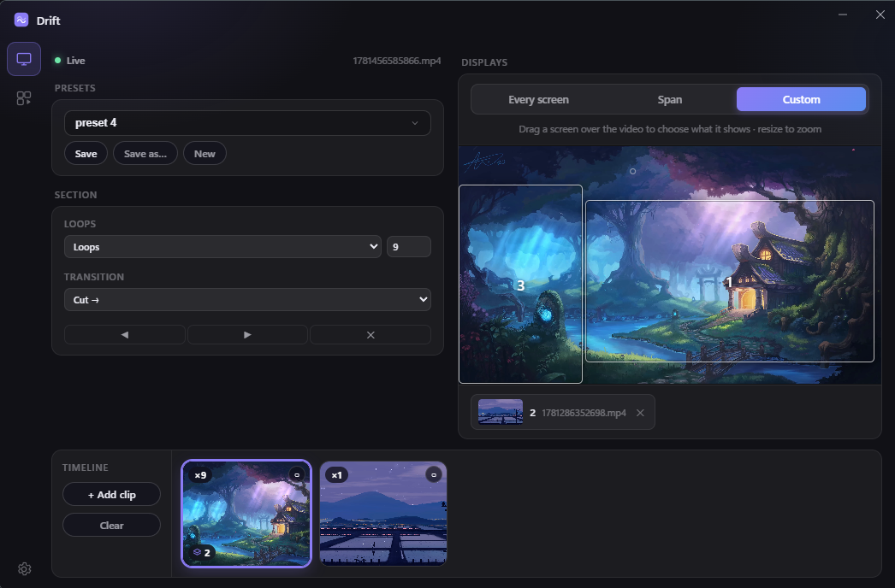

# Drift

A lightweight **live video wallpaper for Windows 11**. Drop in a video and it loops behind your desktop icons — sequence clips on a timeline and lay them out across every monitor.

**[⬇ Download for Windows](https://github.com/Stenbergcool/DRIFT/releases/latest/download/Drift_0.1.0_x64-setup.exe)** · **[Website](https://stenbergcool.github.io/DRIFT/)** · **[Documentation](https://stenbergcool.github.io/DRIFT/docs.html)**

Free, no account, no subscription.

## Features

- **Any video, looped** — MP4 (H.264), WebM, or MOV, hardware-accelerated
- **Behind your icons** — renders into the desktop's own wallpaper layer
- **Multi-monitor** — play on every screen, or span one video across your whole layout
- **Stays out of the way** — pauses automatically for full-screen apps and games, on battery, and on the lock screen
- **Lives in the tray** — close the window and the wallpaper keeps running; optional launch at startup
- **Audio toggle** — muted by default, with a volume slider when you want sound

## Install

1. Download **[Drift_0.1.0_x64-setup.exe](https://github.com/Stenbergcool/DRIFT/releases/latest)** from the latest release.
2. Run it. Installs just for your user — **no admin rights needed**.
3. Pick a video, and your desktop comes alive.

> **Heads up — Windows SmartScreen.** Drift isn't code-signed yet, so on first run Windows may show *"Windows protected your PC."* Click **More info → Run anyway**. The installer is the same file published here on GitHub.

## Requirements

- Windows 11, 64-bit

## Support

Found a bug or have an idea? [Open an issue](https://github.com/Stenbergcool/DRIFT/issues).
